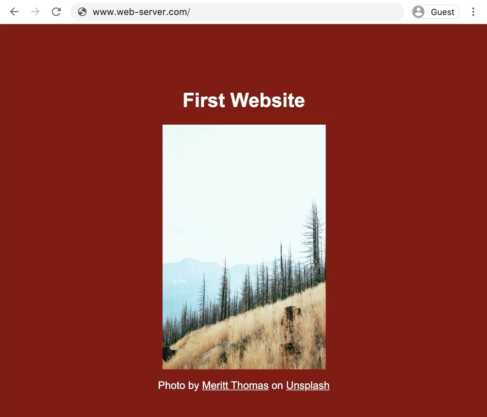

import { Link } from 'gatsby'

Der Webserver im <Link to='/de/blog/webserver'>Artikel über Webserver</Link> lieferte am Ende folgende Webseite aus:



Die Webseite besteht aus einer <a href="https://developer.mozilla.org/de/docs/Web/HTML" target="_blank" rel="noopener noreferrer">HTML</a> Datei, einer <a href="https://developer.mozilla.org/de/docs/Web/CSS" target="_blank" rel="noopener noreferrer">CSS</a> Datei und einem Bild. Der <Link to='/de/blog/html'>letzte Artikel</Link> befasste sich mit HTML, dieser Artikel geht auf die Konzepte von CSS ein.

## CSS Struktur

```css
selektor {
  eigenschaft: wert;
}

/* Beispiel */
h1 {
  color: white;
}
```

## Zweck von CSS

## Specificity

Häufigste Properties hier: https://developer.mozilla.org/en-US/docs/Web/CSS/CSS_Properties_Reference

## Verbindung von HTML und CSS

```html
<link rel="stylesheet" href="styles.css" />
```
