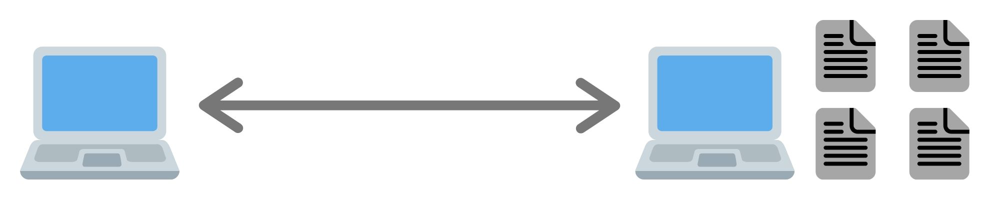

import { Link } from 'gatsby-plugin-intl'

Was geschieht, wenn man eine URL im Browser eingibt und dieser anschliessend eine Webseite anzeigt?

Zunächst kommunizieren dabei zwei Computer. Der eigene Rechner und der Computer auf dem die Webseite abgespeichert ist. Eine Webseite besteht nämlich aus mehrere Dateien und wird vom Computer auf dem diese gespeichert sind zum Computer der sie anzeigen möchte gesendet.



Aus welchen Dateien besteht eine Webseite genau? Die Hauptbestandteile sind [HTML](https://developer.mozilla.org/de/docs/Web/HTML), [CSS](https://developer.mozilla.org/de/docs/Web/CSS) und [JavaScript](https://developer.mozilla.org/de/docs/Web/JavaScript). Daneben gibt es z.B. noch Bilder oder Videos.

- **HTML**: Beschreibt die Struktur einer Webseite. Dazu gehört der Text und die Information, was dieser Text darstellt.<br />
  Beispiele:

  - "Büchersammlung" als Titel

    ```html
    <h1>Büchersammlung</h1>
    ```

  - Buchtitel aufgeführt als Liste
    ```html
    <ul id="buecher-liste">
      <li>Harry Potter und der Stein der Weisen</li>
      <li>Harry Potter und die Kammer des Schreckens</li>
    </ul>
    ```

- **CSS**: Beschreibt das Aussehen der Webseite.<br />
  Beispiele:

  - Titel einmitten

    ```css
    h1 {
      text-align: center;
    }
    ```

  - Listenelemente in blauer Schrift
    ```css
    li {
      color: blue;
    }
    ```

- **JavaScript**: Ist für das Verhalten der Webseite zuständig.<br />
  Beispiel:

  - Finde die Bücherliste und ändere die Farbe zu grün

    ```js
    var buecherListe = document.getElementById('buecher-liste')
    buecherListe.style.color = 'green'
    ```

Der Unterschied zwischen HTML und CSS im Gegensatz zu JavaScript liegt darin, dass in den ersten beiden **beschrieben** wird, was man möchte, bei JavaScript hingegen programmiert man das Verhalten. (WAS möchte ich? vs. WIE soll etwas geschehen?)

Wie weiss der Computer auf dem die Webseite gespeichert ist, dass er die Dateien an den anfragenden Computer senden soll? Diese Aufgabe übernimmt der Webserver. Mehr Informationen dazu gibt es im <Link to="/blog/webserver/">nächsten Blogpost</Link>.

Nachdem alle Dateien übertragen wurden, liest der Browser diese und berechnet daraus, wie die Webseite aussieht. Anschliessend stellt er die Seite dar.

Bei der Webentwicklung geht es also unter anderem um die Erstellung von HTML, CSS und JavaScript, sowie um die Bereitstellung dieser Dateien durch einen Webserver. Online Lernprogramme sowie Bücher zum Erlernen der Sprachen gibt es bereits einige. Hier einige Empfehlungen:

- HTML und CSS:
  - Online gratis: <a href="https://www.learn-html.org/" target="_blank">learn-html.org</a>
  - Buch für Beginner: <a href="https://amzn.to/2W6FX5Y" target="_blank">HTML & CSS: Erfolgreich Websites gestalten und programmieren</a>
- JavaScript:
  - Online gratis: <a href="https://www.learn-js.org/" target="_blank">learn-js.org</a>
  - Buch für Beginner: <a href="https://amzn.to/3aGYo6z" target="_blank">JavaScript & jQuery: Interaktive Websites entwickeln</a>
  - Buch für Fortgeschrittene: <a href="https://amzn.to/3eT0u6J" target="_blank">Professionell entwickeln mit JavaScript: Design, Patterns und Praxistipps für Enterprise-fähigen Code</a>

Dieser Blog wiederholt diese Sprachkurse nicht, sondern fokussiert sich auf die Konzepte und Begriffe der Webentwicklung sowie auf das Zusammenspiel der Technologien. Es wird, wie in diesem Beitrag, das grosse Bild gezeigt, dann aber auch auf die einzelnen Aspekte eingegangen. Mein Ziel ist es, dem Leser ein starkes Verständnis für die Webentwicklung zu geben.
