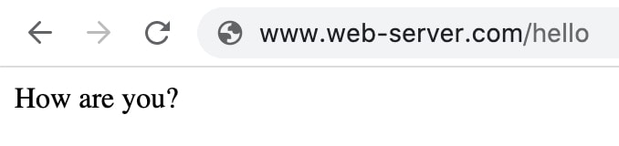

If you visit a website, it is delivered by a web server. But what exactly is a web server?

In my own words:

> A web server is a program that runs on a computer and answers requests from the Internet.

Like any program, a web server follows certain rules that a programmer has defined. The following sample code shows such rules as they are written with [express](https://expressjs.com/). express helps to create a web server. <br />
It is not about understanding the code, but about getting an idea of what such rules look like:

```js
app.get('/', function (request, response) {
  response.send('Home')
})

app.get('/hello', function (request, response) {
  response.send('How are you?')
})
```

- If a URL is entered in the browser, it starts a GET request. [Detailed explanation GET](https://developer.mozilla.org/en-US/docs/Web/HTTP/Methods/GET)
- `'/'` or `'/hello'` defines the path in the URL. For www.google.com/hello-google "/hello-google" is the path.
- Assumption: The computer can be reached at the address www.web-server.com.

The first rule from the shown code is: If the address www.web-server.com<b>/</b> is entered in the browser, then answer with `'Home'`.<br />
The second rule is: If the address www.web-server.com<b>/hello</b> is entered in the browser, then answer with `'How are you?'`.<br/>

In the browser the answer looks like this:



However, the content in the browser window does not look like what we would expect when we visit a "normal" website. The difference is that a website consists of HTML, CSS, JavaScript and other parts. How to create a simple website is the topic of the next blog post.<br />
Basically, HTML and CSS are files that are stored on the same computer on which the web server runs. So we can change the rules so that instead of the words `'Home'` and `'How are you?'`, files are sent to the browser. This will look like this:

```js
app.get('/', function (request, response) {
  response.sendFile(__dirname + '/index.html')
})

app.get('/styles.css', function (request, response) {
  response.sendFile(__dirname + '/styles.css')
})

app.get('/meritt-thomas.jpg', function (request, response) {
  response.sendFile(__dirname + '/meritt-thomas.jpg')
})
```

The file structure looks like this:

```
ProjectFolder
│-- server.js (web server program with the rules shown above)
│-- index.html
│-- styles.css
│-- meritt-thomas.jpg
```

- `__dirname` is the folder path to ProjectFolder (for example: /Users/me/Documents/ProjectFolder)

The first rule from server.js is: If the address www.web-server.com<b>/</b> is entered in the browser, then send the file "index.html" to it. The HTML in turn contains the information on how to load the CSS file and the image. So in a second step the browser asks for these two files.<br />
The second and third rule then answer the requests for the CSS and the image.

After the browser has downloaded everything, the page looks like this:


---

Note: The listed rules are extremly simplified. The procedure does not work if a web page has many CSS files or images. express offers [better methods](http://expressjs.com/en/starter/static-files.html) to deliver files.

---

> If I want to create a website, do I always have to write a web server myself?

To make a website available, you always need a web server. But you don't have to write it yourself, because there are many platforms (so called webhosters) which do this work for you. Examples for free webhosters:

- Netlify Drop: https://app.netlify.com/drop
- Render: https://render.com/
- GitHub Pages: https://pages.github.com/

---

In order to make this article as simple as possible, a number of questions were deliberately left open. These will be addressed in the following articles. Examples:

- How do I write a simple website like the one shown above?
- How does my browser know which files to request from the web server to load the complete website?
- If I enter a URL, how does my web browser find the computer running the web server?

If you have further open questions or suggestions, please leave a comment.
