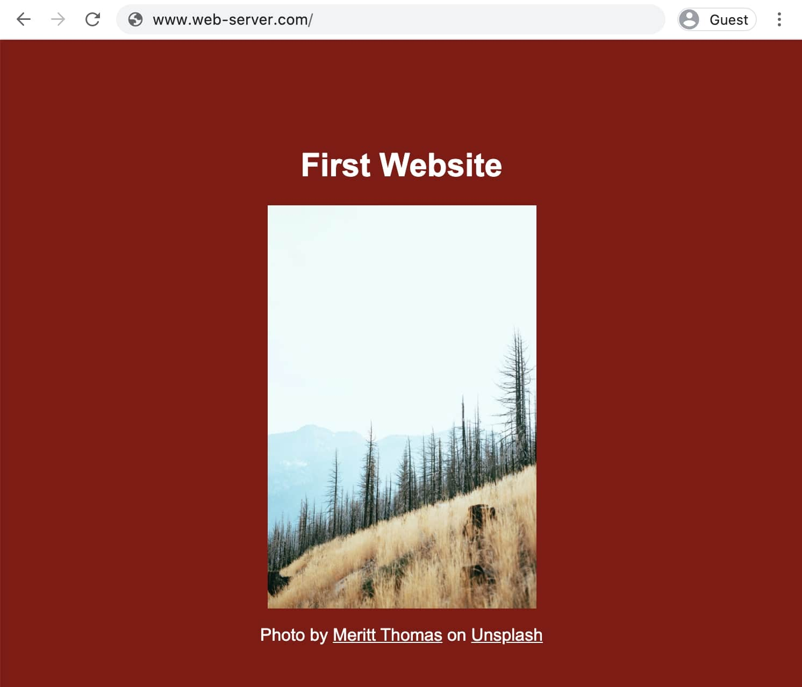

Ruft man eine Webseite auf, so wird diese von einem Webserver ausgeliefert. Was ist aber eigentlich ein Webserver?

In meinen eigenen Worten:

> Ein Webserver ist ein Programm, das auf einem Computer läuft und Anfragen aus dem Internet beantwortet.

Wie jedes Programm, folgt ein Webserver bestimmten Regeln, welche ein Programmierer festgelegt hat. Der folgende Beispielcode zeigt solche Regeln.<br />
Es geht nicht darum den Code zu verstehen, sondern eine Idee davon zu bekommen, wie solche Regeln aussehen:

```js
app.get('/', function (request, response) {
  response.send('Home')
})

app.get('/hello', function (request, response) {
  response.send('How are you?')
})
```

- Wenn eine URL im Browser eingegeben wird, so startet dieser eine GET-Anfrage. [Genauere Erklärung GET](https://developer.mozilla.org/de/docs/Web/HTTP/Methods/GET)
- `'/'` bzw. `'/hello'` definiert den Pfad in der URL. Bei www.google.com/hello-google ist "/hello-google" der Pfad.
- Annahme: Der Computer ist unter der Adresse www.web-server.com erreichbar.

Die erste Regel aus dem gezeigten Code lautet: Wenn im Browser die Adresse www.web-server.com<b>/</b> eingegeben wird, dann antworte mit `'Home'`.<br/>
Die zweite Regel lautet: Wenn im Browser die Adresse www.web-server.com<b>/hello</b> eingegeben wird, dann antworte mit `'How are you?'`.<br/>

Im Browser sieht die Antwort dann so aus:


Diese Antwort sieht allerdings nicht so aus, wie wenn wir eine "normale" Webseite aufrufen. Der Unterschied liegt darin, dass eine Webseite aus HTML, CSS, JavaScript und weiteren Teilen besteht. Wie eine einfache Webseite erstellt wird, ist Thema des nächsten Blogbeitrages.<br />
Grundsätzlich sind HTML und CSS aber Dateien, welche auf dem gleichen Computer abgespeichert sind, auf welchem der Webserver läuft. Wir können also die Regeln so ändern, dass Anstatt den Wörtern `'Home'` und `'How are you?'`, Dateien an den Browser geschickt werden. Dies sieht dann so aus:

```js
app.get('/', function (request, response) {
  response.sendFile(__dirname + '/index.html')
})

app.get('/styles.css', function (request, response) {
  response.sendFile(__dirname + '/styles.css')
})

app.get('/landscape.jpg', function (request, response) {
  response.sendFile(__dirname + '/landscape.jpg')
})
```

Die Dateistruktur sieht dabei folgendermassen aus:

```
ProjektOrdner
│-- server.js (Webserver Programm mit den oben gezeigten Regeln)
│-- index.html
│-- styles.css
│-- landscape.jpg
```

- `__dirname` ist dabei der Ordnerpfad zu ProjektOrdner (zum Beispiel: /Users/me/Documents/ProjektOrdner)

Die erste Regel aus server.js lautet: Wenn im Browser die Adresse www.web-server.com<b>/</b> eingegeben wird, dann sende ihm die Datei "index.html". Das HTML wiederum enthält die Information, wie es die CSS Datei und das Bild laden kann. Er fragt in einem zweiten Schritt also nach diesen beiden Dateien.<br />
Die zweite und dritte Regel beantworten dann die Anfrage nach dem CSS und dem Bild.

Nachdem der Browser alles heruntergeladen hat, sieht die Seite wie folgt aus:



Den kompletten Code gibt es auf <a href="https://www.buymeacoffee.com/l/webserver" target="_blank" rel="noopener noreferrer">buymeacoffee.com</a>. Dabei unterstützt du gleichzeitig weitere Artikel. Danke!

---

Hinweis: Die aufgeführten Regeln sind sehr vereinfacht. Das Vorgehen funktioniert so nicht, wenn eine Webseite viele CSS Dateien oder Bilder hat. Es gibt bessere Regeln, um Dateien auszuliefern.

---

> Wenn ich eine Webseite erstellen will, muss ich immer einen Webserver selber schreiben?

Um eine Webseite verfügbar zu machen, braucht es immer einen Webserver. Dieser muss aber nicht selbst geschrieben werden, da es viele Platformen (sogenannte Webhoster) gibt, welche diese Arbeit übernehmen. Beispiele für gratis Webhoster:

- Netlify Drop: https://app.netlify.com/drop
- Render: https://render.com/
- GitHub Pages: https://pages.github.com/

---

Um diesen Artikel so einfach wie möglich zu gestalten, wurden bewusst einige Fragen offen gelassen. Auf diese wird in den nächsten Artikeln eingegangen. Beispiele:

- Wie schreibe ich eine einfache Webseite, wie diejenige, die oben gezeigt wird?
- Wie weiss mein Browser, welche Dateien er beim Webserver anfragen muss, um die komplette Webseite zu laden?
- Wenn ich eine URL eingebe, wie findet mein Webbrowser den Computer auf dem der Webserver läuft?

Falls du weitere offene Fragen oder Anregungen hast, hinterlasse doch einen Kommentar.
